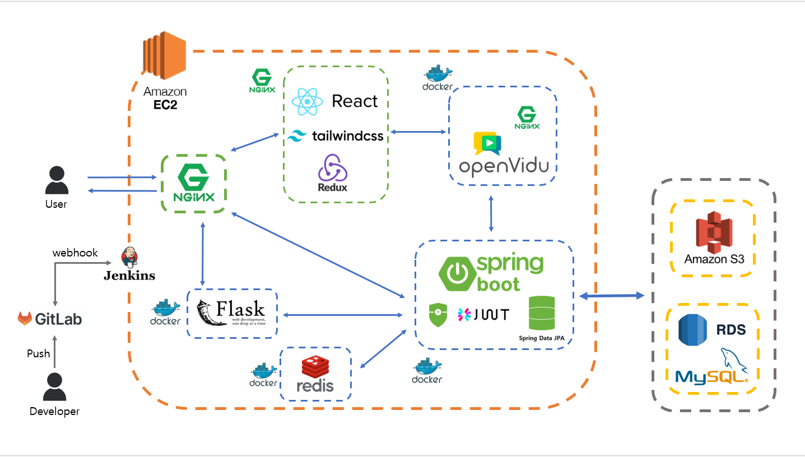
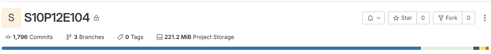
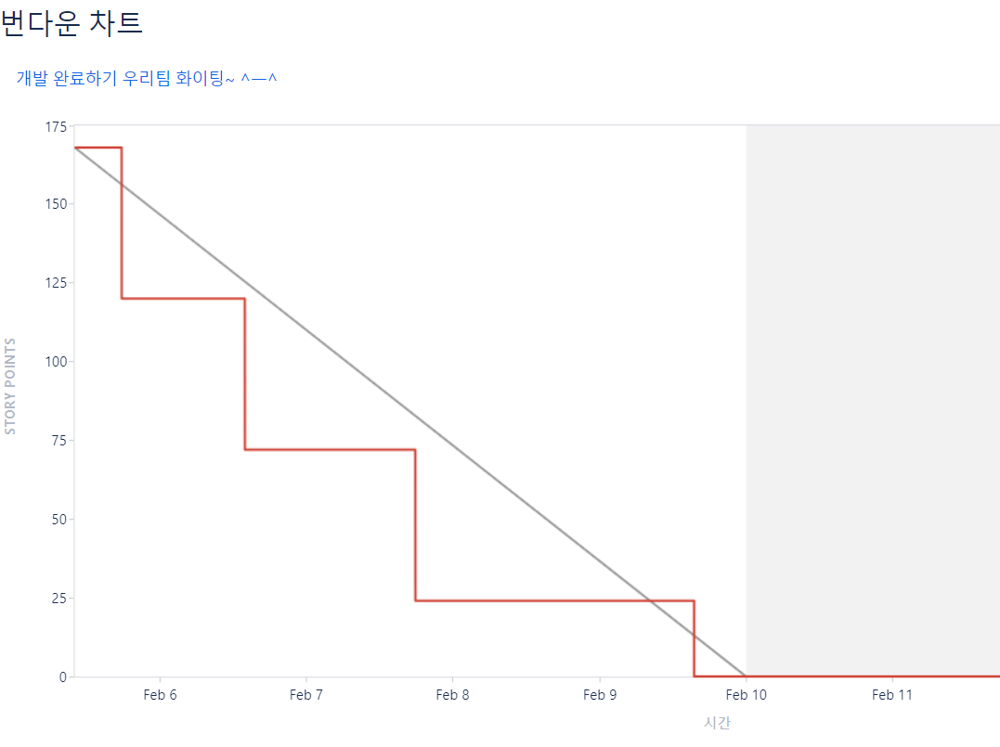
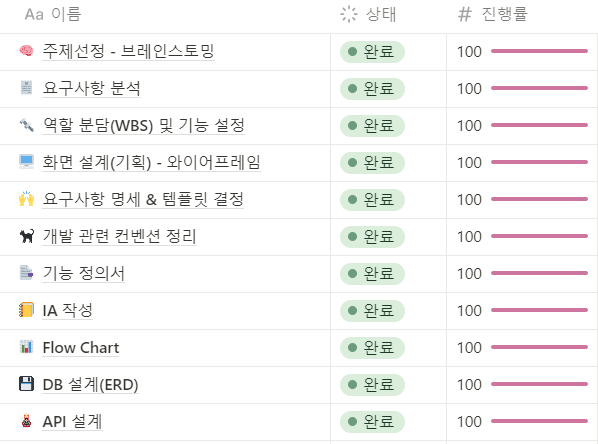

# :stars: 별자리 - 영상통화 팬싸인회 All in One 플랫폼

## :link: 별자리 링크(웹 화면): [별자리로 이동](https://i10e104.p.ssafy.io/)

## :clapper: 소개 영상 보기 : [UCC](유씨씨 링크 걸어주세요) | [시연 영상](시연 영상 링크 걸어주세요)

## :date: 프로젝트 진행 기간
<b>2024.01.03(수) ~ 2024.02.16(금)</b>: 44일간 진행  
SSAFY 10기 2학기 공통 프로젝트 - 별자리

## :star: 별자리 기획 배경
:heavy_check_mark: 팬싸인회 과정의 분산: 기존) 팬싸인회 응모, 당첨자 선발, 팬싸인회 진행, 본인인증 과정이 다 따로 진행 
:heavy_check_mark: 비대면 소통의 한계 
:heavy_check_mark: 짧은 진행시간으로 인한 아쉬움

## :star2: 별자리 설명
- All in One 플랫폼으로 모든 서비스를 한 플랫폼에서 제공 
     :arrow_forward: 팬싸인회 개설, 응모, 당첨, 팬싸인회 진행, 본인 인증, 인생네컷 등 모든 과정을 <b>'별자리'</b>에서
- 본인인증 자동화 + 구매 내역 인증 자동화 
     :arrow_forward: 불필요한 절차 감소
- 스크립트/포스트잇 기능 추가  
     :arrow_forward: 비대면 소통의 불편함 감소
- 인생네컷 기능 추가  
     :arrow_forward: 아티스트와 둘만의 추억 제공

## :hammer: 개발 환경 및 기술 스택
### BE

 

 

 

 

### FE

 

 

### INFRA

 

### 버전/이슈 관리

### TOOL

### 협업

### IDE

## :bar_chart: 아키텍처 구조

## :file_folder: 프로젝트 파일 구조
fe 
 ┣ .vscode 
 ┃ ┗ settings.json 
 ┣ docker 
 ┃ ┣ create_image.sh 
 ┃ ┣ Dockerfile 
 ┃ ┗ entrypoint.sh 
 ┣ node_modules 
 ┣ public 
 ┣ src 
 ┃ ┣ Openvidu 
 ┃ ┃ ┣ Artist 
 ┃ ┃ ┣ Fan 
 ┃ ┃ ┣ Station 
 ┃ ┃ ┣ View 
 ┃ ┃ ┗ Socket.js 
 ┃ ┣ Web 
 ┃ ┃ ┣ Artist 
 ┃ ┃ ┣ Assets 
 ┃ ┃ ┣ Fan 
 ┃ ┃ ┣ Home 
 ┃ ┃ ┣ Pages 
 ┃ ┃ ┣ Stores 
 ┃ ┃ ┣ Utils 
 ┃ ┣ App.js 
 ┃ ┣ AppRoutes.js 
 ┃ ┣ index.css 
 ┃ ┣ index.js 
 ┃ ┗ registerServiceWorker.js 
 ┣ .env 
 ┣ .gitignore 
 ┣ .prettierrc 
 ┣ config-overrides.js 
 ┣ package-lock.json 
 ┣ package.json 
 ┣ postcss.config.js 
 ┣ README.md 
 ┣ tailwind.config.js 
 ┗ test_txt.txt 

flask 
 ┣ .gitignore 
 ┣ app.py 
 ┣ dlib-19.22.99-cp39-cp39-win_amd64.whl 
 ┣ Dockerfile 
 ┣ life4cut.jpg 
 ┗ requirements.txt 

BE 
 ┣ .gradle 
 ┣ build 
 ┣ out 
 ┣ src 
 ┃ ┣ main 
 ┃ ┃ ┣ java 
 ┃ ┃ ┃ ┗ com 
 ┃ ┃ ┃ ┃ ┗ example 
 ┃ ┃ ┃ ┃ ┃ ┗ be 
 ┃ ┃ ┃ ┃ ┃ ┃ ┣ applicant 
 ┃ ┃ ┃ ┃ ┃ ┃ ┣ artist 
 ┃ ┃ ┃ ┃ ┃ ┃ ┣ artistfansign 
 ┃ ┃ ┃ ┃ ┃ ┃ ┣ common 
 ┃ ┃ ┃ ┃ ┃ ┃ ┣ config 
 ┃ ┃ ┃ ┃ ┃ ┃ ┣ exception 
 ┃ ┃ ┃ ┃ ┃ ┃ ┣ fan 
 ┃ ┃ ┃ ┃ ┃ ┃ ┣ member 
 ┃ ┃ ┃ ┃ ┃ ┃ ┣ memberfansign 
 ┃ ┃ ┃ ┃ ┃ ┃ ┣ photo 
 ┃ ┃ ┃ ┃ ┃ ┃ ┣ s3 
 ┃ ┃ ┃ ┃ ┃ ┃ ┣ scheduling 
 ┃ ┃ ┃ ┃ ┃ ┃ ┣ session 
 ┃ ┃ ┃ ┃ ┃ ┃ ┣ stmp 
 ┃ ┃ ┃ ┃ ┃ ┃ ┣ winning 
 ┃ ┃ ┃ ┃ ┃ ┃ ┗ BeApplication.java 
 ┃ ┃ ┗ resources 
 ┃ ┃ ┃ ┣ static 
 ┃ ┃ ┃ ┣ templates 
 ┃ ┃ ┃ ┣ application-oauth.yml 
 ┃ ┃ ┃ ┣ application.properties 
 ┃ ┃ ┃ ┗ application.yml 
 ┃ ┗ test 
 ┣ .gitignore 
 ┣ build.gradle 
 ┣ Dockerfile 
 ┣ gradlew 
 ┣ gradlew.bat 
 ┗ settings.gradle 

## :sparkler: 별자리 주요 기능
### 1. 팬싸인회 개설
- CLOVA AI의 <b>OCR API</b>를 사용하기 위해서, 영수증 내 비교 대상을 확인하기 위해 앨범명을 지정 

### 2. 팬싸인회 응모
- 응모 중인 팬싸인회에 <b>영수증</b> 사진을 첨부하여 구매 내역 확인 절차를 따로 하지 않아도 됨 

### 3. 팬싸인회 당첨
- Scheduler cron을 활용하여 매일 당첨자를 일정 시간에 선정
- 선정 후, 당첨자에게 메일로 당첨 여부 전송

### 4. 팬싸인회 대기방
- 본인인증: 저장된 인증 용 사진과 현재 카메라에 있는 얼굴을 대조해 별도의 본인인증 과정 삭제
- 마이크 테스트: 비대면 팬싸인회 중, 마이크 이상 문제를 예방하기 위한 조치
- 내 순서 / 대기시간: 순서와 대기 시간을 명시해주어 무한 대기로 인한 피로도 감소
- 포스트잇: 팬이 아티스트에게 하고 싶은 말 전달 (WebSocket으로 아티스트 세션으로 전달)
- 스크립트: 팬이 준비한 대본을 같은 화면에 띄워줄 수 있도록 도와주는 기능
- 채팅방: 팬들끼리 팬싸인회 전, 대기방에서 소통할 수 있는 기능

### 5. 팬 - 팬싸인회 중!
- 대기방에서 작성한 스크립트가 팬의 팬싸인회 화면에 출력
- 아티스트와 원하는 포즈로 네 컷의 사진을 찍을 수 있음
- 남은 시간을 확인할 수 있어 팬싸인회 시간 효율적으로 사용 가능

### 6. 아티스트 - 팬싸인회 중!
- 팬의 개인 정보(이름, 생년월일)을 전송받아 팬의 기본 정보 확인 가능

### 7. 인생네컷 

## :memo: 프로젝트 산출물
- [프로토타입](https://www.figma.com/file/CWaNMfmbjIx4OU44aDYnfx/%EB%B3%84%EC%9E%90%EB%A6%AC-%ED%94%84%EB%A1%9C%ED%86%A0%ED%83%80%EC%9E%85?type=design&node-id=877-101&mode=design&t=tKue4eC84VsZk1pd-0)
- [요구사항 명세서](https://docs.google.com/spreadsheets/d/19WOuXo1cfLn9-JUh5jZQgVFT3Eol9RZOP_vrdUK_onU/edit#gid=1006392993)
- [API 명세서](https://www.notion.so/API-c0b714bad22b4587ad1081d8d67c7351)
- [ERD](https://lab.ssafy.com/s10-webmobile1-sub2/S10P12E104/-/blob/master/readme_files/ERD.png?ref_type=heads)
- [회의록](https://www.notion.so/b56165eed27a4313ac10bd94d46028a8?v=bc135a67af31467dbeeffc95980769c4)
- [포팅 메뉴얼](https://lab.ssafy.com/s10-webmobile1-sub2/S10P12E104/-/blob/master/exec/%ED%8F%AC%ED%8C%85_%EB%A9%94%EB%89%B4%EC%96%BC.md?ref_type=heads)

## :bulb: 개발 문화
- 데일리 <b>스크럼</b> 회의로 <b>애자일</b> 방식 개발 지향
- 노션, GitLab 적극 활용 - <b>문서화, 가시화</b>로 정확한 의사소통
- Jira로 데일리 일정 관리
- 의견은 자유롭게! 
### GitLab

### Jira

### Notion

## :family: 팀원 소개
<table>
  <tbody>
    <tr>
      <td align="center"><a href="https://github.com/ttaho"> <b>BE 팀장 : 윤태호</b></a> </td>
      <td align="center"><a href="https://github.com/MunsooKang"> <b>FE 팀원 : 강문수</b></a> </td>
      <td align="center"><a href="https://github.com/arim-kim"> <b>BE 팀원 : 김아림</b></a> </td>
      <td align="center"><a href="https://github.com/makie082"> <b>BE 팀원 : 우미경</b></a> </td>
     <tr/>
      <td align="center"><a href="https://github.com/dogfish000"> <b>FE 팀원 : 윤태우</b></a> </td>
      <td align="center"><a href="https://github.com/RaelJung"> <b>FE 팀원 : 정라엘</b></a> </td>
    </tr>
  </tbody>
</table>
